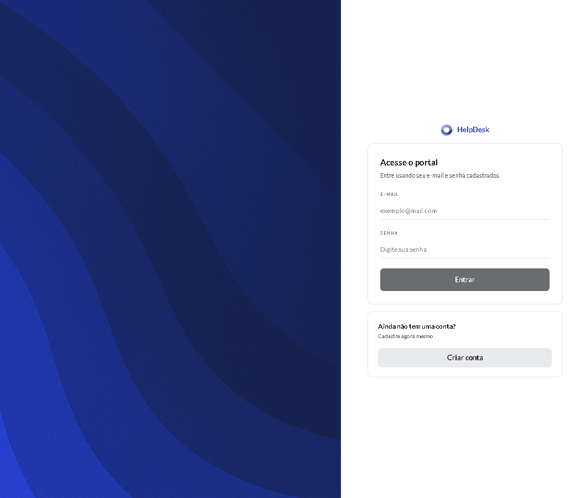
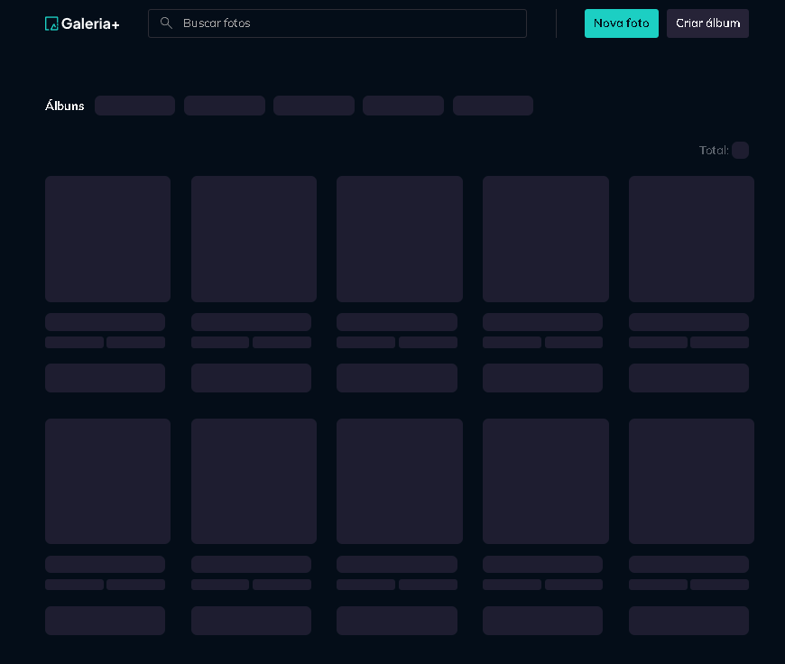

# Portfolio CL


Site portfolio pessoal construido com React e Vite, com animacoes AOS e grade de projetos com modal de imagens.

## Tecnologias

- React
- TypeScript
- Vite
- AOS

## Projetos em destaque

- App de HelpDesk: sistema para registrar e acompanhar chamados de suporte.
- Projeto Refund: aplicativo web para gerenciamento de reembolsos corporativos.
- API de Reembolso: API para gerenciar reembolsos de despesas.
- Pet Shop: gerenciamento de clientes, pets, servicos e agendamentos.
- Calculadora: calculadora simples em React (CDN).
- Galeria-Plus: galeria de imagens com funcionalidades avancadas.

Para editar a lista de projetos, atualize `src/components/Projects.tsx`.

## Screenshots





## Como rodar

```bash
npm install
npm run dev
```

## Build e preview

```bash
npm run build
npm run preview
```

## Deploy

```bash
npm run deploy
```
